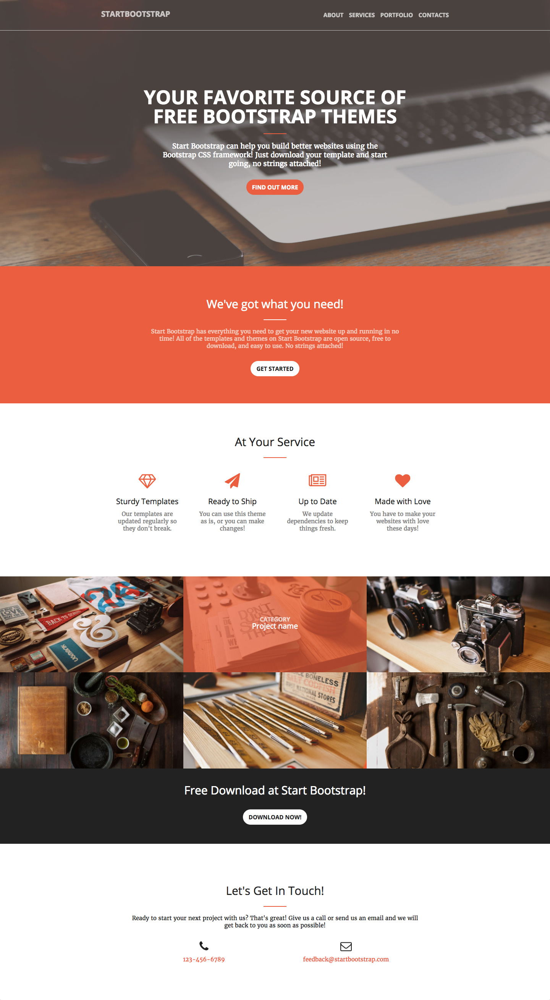

# Intégration du design de la single page BlackRockDigital
Vous devez réaliser l'intégration complète de la page d'accueil dont le design vous est présenté sur le fichier CREA.jpg. Afin de mener à bien ce projet, vous devez respecter les étapes suivantes :
- Intégrer tous le contenu dans le fichier HTML
- Une fois le contenu intégré, ajouter le CSS
- Commencer par les style généraux.

## Présentation du projet

## Charte graphique
Le design de la page à été pensé avec les éléments suivants :
- Police des titres : 'Open Sans'
- Police des textes : 'Merriweather'
- Référence pour le orange : eb5f3f
- Référence pour le gris : 222222
- Largeur de la colonne principale : 950px
- Les pictos sont issus de FontAwesome

## Contenu de la page
### Menu
- Startbootstrap
- About
- Services
- Portfolio
- Contacts

### Zone 1
- Your Favorite Source of Free Bootstrap Themes
- Start Bootstrap can help you build better websites using the Bootstrap CSS framework! Just download your template and start going, no strings attached!
- Find out more

### Zone 2
- We've got what you need!
- Start Bootstrap has everything you need to get your new website up and running in no time! All of the templates and themes on Start Bootstrap are open source, free to download, and easy to use. No strings attached!
- Get started

### Zone 3
- At Your Service
- Sturdy Templates
- Our templates are updated regularly so they don't break.
- Ready to Ship
- You can use this theme as is, or you can make changes!
- Up to Date
- We update dependencies to keep things fresh.
- Made with Love
- You have to make your websites with love these days!

### Zone 4
- Category
- Project name

### Zone 5
- Free Download at Start Bootstrap!
- Download now!

### Zone 6
- Let's Get In Touch!
- Ready to start your next project with us? That's great! Give us a call or send us an email and we will get back to you as soon as possible!
- 123-456-6789
- feedback@startbootstrap.com